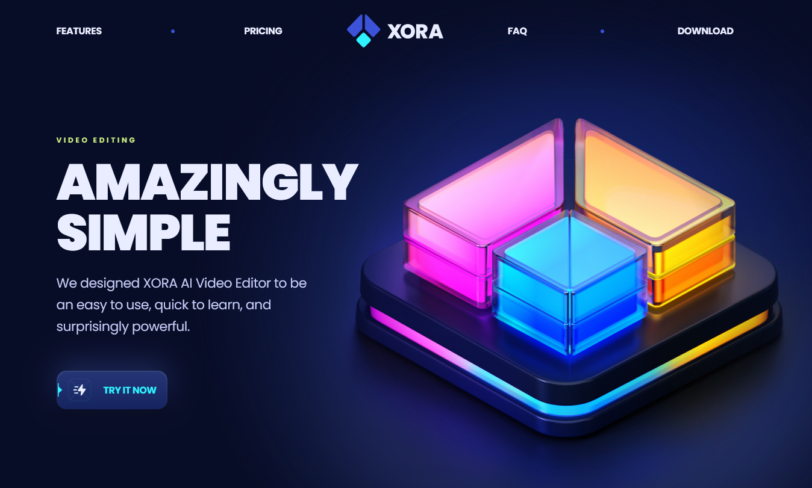
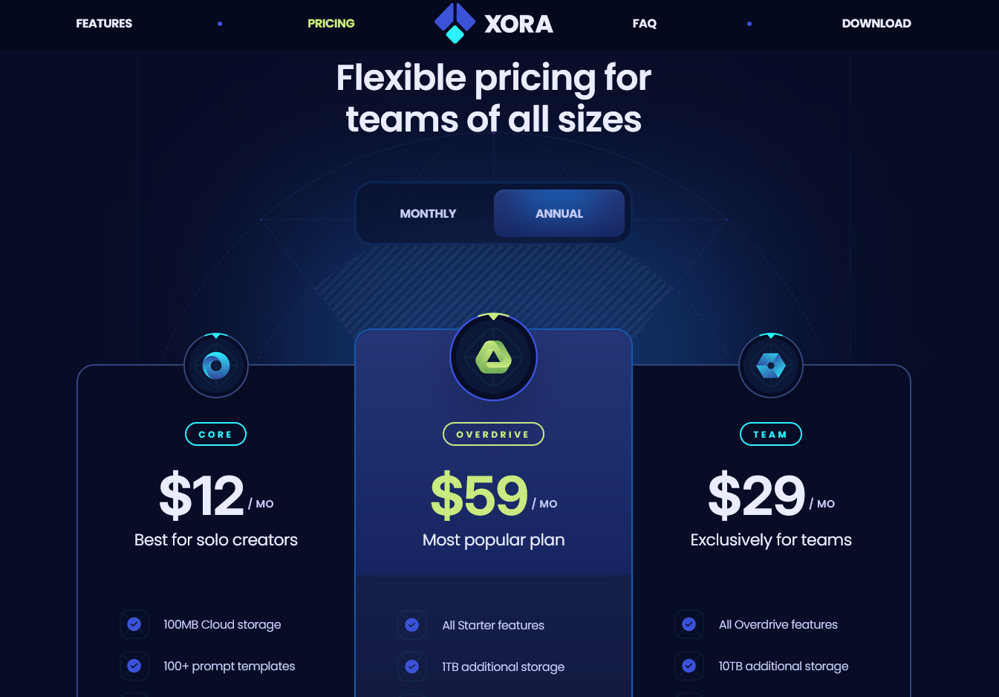
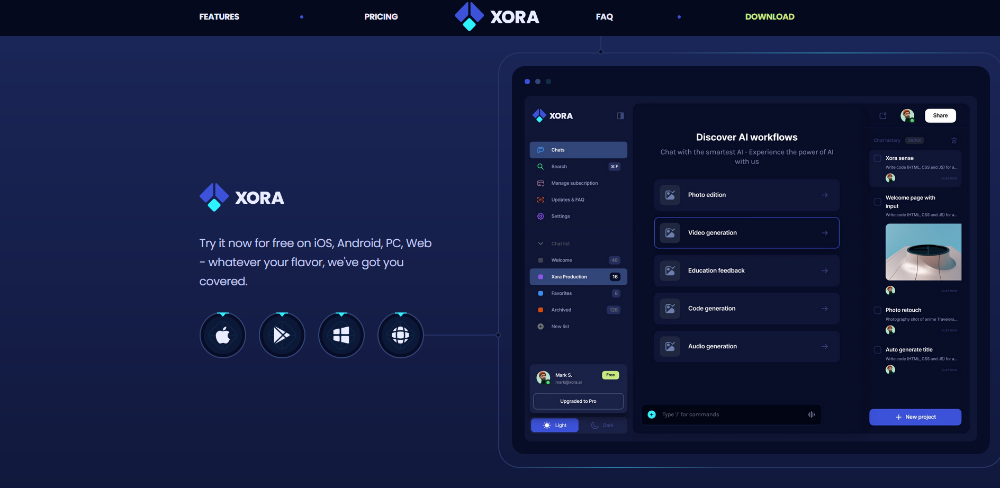

# Portfolio SaaS Website

This is a modern, responsive SaaS website that I built to explore and practice UI/UX design principles. It's created with React.js and Tailwind CSS, combining functionality and aesthetics in a way that feels seamless and intuitive.

---

## 📋 Table of Contents

1. [Introduction](#-introduction)
2. [Tech Stack](#%EF%B8%8F-tech-stack)
3. [Features](#-features)
4. [Setup and Installation](#-setup-and-installation)
5. [Details](#-details)
6. [License](#-license)

---

## 🤖 Introduction

I enjoy building applications that combine thoughtful design and robust functionality. This project started as an experiment with modern web tools and grew into a fully responsive and visually engaging web application.

### Purpose

My aim was to:

- Create designs that look good on any device.
- Experiment with smooth animations for better interactivity.
- Build reusable and maintainable components for scalability.

---

## ⚙️ Tech Stack

Here’s what I used to build this project:

- **React.js**: A library for building user interfaces.
- **Tailwind CSS**: A utility-first framework for efficient styling.
- **Vite**: A fast development build tool.

---

## 🔋 Features

- **Hero Section**: A strong introduction with a clean and engaging layout.
- **Features Section**: Highlights of the app’s core functionalities.
- **Pricing Section**: Switchable options for monthly or yearly plans.
- **FAQ Section**: Common questions addressed clearly.
- **Testimonials Section**: A space for user feedback.
- **Download Section**: A call-to-action encouraging users to engage further.
- **Smooth Animations**: Transitions and effects that add polish.
- **Responsive Design**: Ensures usability across different screen sizes.

---

## 🤸 Setup and Installation

If you'd like to explore this project locally, here’s how you can set it up:

### Prerequisites

Ensure you have the following installed:

- **Git**
- **Node.js**
- **npm** (Node Package Manager)

### Steps

1. **Clone the Repository**

   ```bash
   git clone <your-repository-url>
   cd <repository-folder>
   ```

2. **Install Dependencies**

   ```bash
   npm install
   ```

3. **Run the Development Server**

   ```bash
   npm run dev
   ```

4. **Access the Application**

   Open your browser and navigate to `http://localhost:5173`.

---

## 🖼️ Screenshots

Here are some snapshots of the application:

1. **Hero Section**

   

2. **Pricing Section**

   

3. **Call to action Section**

   

---

**Note:** This project isn’t currently hosted online. To explore it, follow the setup instructions above.
